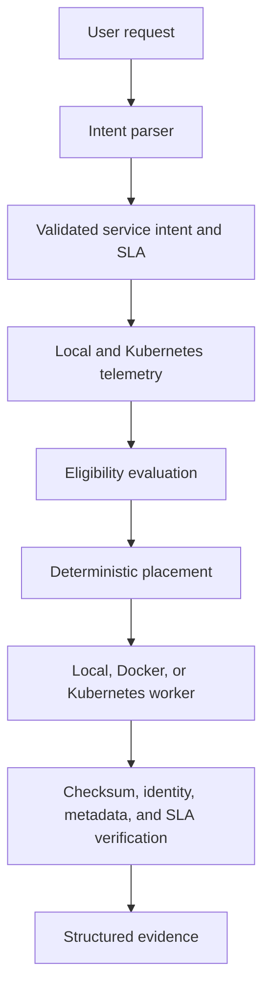

# AION-6G

AION-6G is an AI-native, 6G-oriented experimental intent and resource orchestration testbed for Cloud-Edge systems.

It is not a real telecom deployment, operator network, radio-access implementation, or production 6G platform. The project demonstrates intent-driven placement, bounded workload execution, telemetry-aware decisions, truthful runtime verification, fallback behavior, and reproducible evidence generation in a controlled environment.

## What the system does

1. Accepts a natural-language service request.
2. Parses it into a validated service intent and SLA.
3. Collects local and Kubernetes telemetry.
4. Evaluates candidate eligibility and deterministic placement scores.
5. Executes an allowlisted bounded workload on the selected worker.
6. Verifies runtime identity, checksum, metadata, and SLA conditions.
7. Persists structured JSON evidence and experiment summaries.

Supported execution targets:

- `local-edge`
- `kubernetes-edge`

Supported placement policies:

- `always-local`
- `always-kubernetes`
- `adaptive`

## Architecture



## Features

- Deterministic natural-language intent parsing
- Strict Pydantic input and SLA validation
- Three experimental service profiles: `critical-control`, `immersive-xr`, and `massive-iot`
- Local, Docker, and Kubernetes worker identities
- Telemetry provenance labels for measured, emulated, controlled, and unavailable values
- Deterministic eligibility filtering and placement scoring
- Allowlisted workloads with bounded parameters and request timeouts
- One-retry cross-runtime fallback without fabricated success
- FastAPI API and lightweight dashboard
- Timestamped JSON evidence and CSV/JSON experiment summaries
- Unit, Docker integration, and Kubernetes integration tests

## Requirements

- Python 3.11 or newer
- Docker Desktop for Docker validation
- `kind` and `kubectl` for Kubernetes validation

## Quick start

```powershell
py -3.11 -m venv .venv
.\.venv\Scripts\Activate.ps1
python -m pip install -r requirements.txt
python -m uvicorn app.main:app --host 127.0.0.1 --port 8000
```

Open <http://127.0.0.1:8000/>.

## Docker

```powershell
docker compose -p aion6g build
docker compose -p aion6g up -d
docker compose -p aion6g ps
```

## Kubernetes with kind

```powershell
.\scripts\create_cluster.ps1
.\scripts\deploy_kubernetes.ps1
kubectl --context kind-aion-6g-cluster port-forward -n aion-6g service/aion6g-worker 8002:8001
```

The Kubernetes deployment is isolated in cluster `aion-6g-cluster` and namespace `aion-6g`.

## Testing

Standard test suite:

```powershell
py -3.11 -m pytest -m "not docker and not kubernetes" -ra
```

Docker integration test, with the Compose stack running:

```powershell
$env:AION_RUN_DOCKER_TESTS='1'
py -3.11 -m pytest -m docker -ra
```

Kubernetes integration test, with the kind worker deployed and port-forwarded:

```powershell
$env:AION_RUN_KUBERNETES_TESTS='1'
py -3.11 -m pytest -m kubernetes -ra
```

## Experiments and evidence

```powershell
python scripts/run_full_validation.py
python scripts/generate_experiment_evidence.py
python scripts/generate_charts.py
python scripts/build_final_artifacts.py
```

Runtime evidence is generated under `results/`. Generated JSON, CSV, and PNG files are intentionally ignored by Git because they are environment-specific and reproducible.

## Documentation

- [Architecture](docs/architecture.md)
- [Experimental methodology](docs/experimental-methodology.md)
- [Results guide](docs/results-guide.md)
- [Limitations](docs/limitations.md)
- [Final validation summary](docs/final-validation.md)
- [Extended technical evidence report](docs/AION-6G_Technical_Report_Extended_Evidence.docx)

## Security boundaries

- No arbitrary shell-execution API
- Strict workload allowlist and numeric parameter bounds
- Fixed Kubernetes context, namespace, deployment, and container configuration
- HTTP and subprocess timeouts
- Internally generated evidence paths
- Localhost-only worker endpoints by default
- No credentials stored in manifests or the tracked `.env.example`

## Limitations

- This is an experimental Cloud-Edge testbed, not production telecom infrastructure.
- Local, Docker, and kind runtimes can share the same physical host.
- Kubernetes CPU and RAM telemetry requires a working Metrics API.
- Scenario jitter, packet loss, and bandwidth values are emulated unless explicitly reported otherwise.
- Localhost and port-forwarded HTTP latency are not radio or WAN measurements.

## Repository structure

```text
AION-6G/
|-- app/          Application, orchestration, telemetry, and workloads
|-- deployments/ Docker and Kubernetes deployment files
|-- docs/         Architecture, validation, security, and final report
|-- profiles/     Experimental service profiles
|-- scripts/      Setup, validation, evidence, and experiment helpers
|-- tests/        Unit and opt-in integration tests
|-- .env.example  Safe configuration template
|-- pyproject.toml
`-- README.md
```

## License

See [LICENSE](LICENSE).
