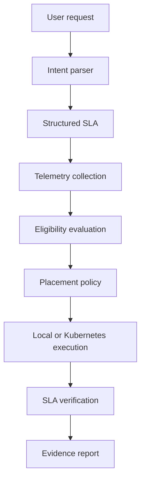

# AION-6G

AION-6G is an AI-native, 6G-oriented experimental intent and resource orchestration testbed for Cloud–Edge systems.

This project is not a real telecom deployment, real operator network, or production 6G system. It is an experimental research and portfolio project for demonstrating intent-driven placement, bounded workload execution, telemetry-based decision making, and evidence reporting for Cloud–Edge scenarios.

## Project overview

The system accepts a natural-language service requirement, parses it into a structured service intent and SLA, evaluates candidate execution targets, selects a target using deterministic placement logic, executes a safe workload, verifies the result, and records structured evidence. The implementation supports two execution targets:

- local-edge
- kubernetes-edge

## Motivation

The project is designed for university research applications, technical portfolio use, and live demonstrations of AI-native orchestration concepts in a controlled environment. It emphasizes clarity, transparency, and evidence-based experimentation rather than claims of real telecom infrastructure.

## Accurate positioning

AION-6G is best described as:

> An AI-native, 6G-oriented experimental intent and resource orchestration testbed for Cloud–Edge systems.

It does not claim real 6G deployment, real radio measurements, real network slicing, or production readiness.

## Architecture



## Features

- Deterministic parsing of natural-language requirements
- Structured Pydantic intent validation
- Telemetry collection for local and Kubernetes targets
- Candidate eligibility evaluation and deterministic scoring
- Safe bounded workload execution
- SLA verification and one-time fallback
- Lightweight FastAPI dashboard
- Timestamped JSON result artifacts
- Optional LLM-assisted intent parsing path that is disabled by default

## Quick start without Kubernetes

1. Create and activate a Python 3.11 virtual environment.
2. Install dependencies:
   ```powershell
   py -3.11 -m pip install -r requirements.txt
   ```
3. Start the API:
   ```powershell
   py -3.11 -m uvicorn app.main:app --host 127.0.0.1 --port 8000
   ```
4. Open the dashboard at http://127.0.0.1:8000/.

## Docker setup

```powershell
docker compose build
docker compose up
```

The app will be available at http://127.0.0.1:8000/.

## Kubernetes kind setup

```powershell
./scripts/create_cluster.ps1
./scripts/deploy_kubernetes.ps1
```

## Example intent

```text
Deploy a critical-control workload with latency below 20 ms and CPU below 70%.
```

## Example orchestration response

```json
{
  "intent": {
    "service_type": "critical-control",
    "max_latency_ms": 20,
    "max_cpu_percent": 70,
    "priority": "reliability"
  },
  "selected_target": "local-edge",
  "verification": {
    "status": "PASSED"
  }
}
```

## Service profiles

The project ships with three experimental profiles:

- critical-control
- immersive-xr
- massive-iot

These are 6G-inspired service profiles and are not official standardized 6G slice definitions.

## Placement policies

- always-local
- always-kubernetes
- adaptive

## Experiment scenarios

- baseline
- local-high-cpu
- kubernetes-high-latency
- packet-loss-degradation
- selected-target-failure
- no-eligible-target

## Testing

Run the test suite:

```powershell
py -3.11 -m pytest -q
```

## Security

- Strict Pydantic validation
- Workload allowlist
- Bounded numeric parameters
- No arbitrary shell execution through the API
- No secrets committed to the repository
- Localhost-only defaults

## Limitations

- This is an experimental testbed, not a real 6G deployment.
- Kubernetes telemetry depends on the local environment and metrics-server availability.
- The dashboard is intentionally lightweight.

## Future work

- Add richer telemetry integrations
- Add more sophisticated placement heuristics
- Add stronger Kubernetes integration and cluster-specific tests
- Add richer experiment summaries and charts

## Repository structure

```text
AION-6G/
├── app/
├── profiles/
├── deployments/
├── scripts/
├── tests/
├── docs/
├── results/
└── README.md
```
