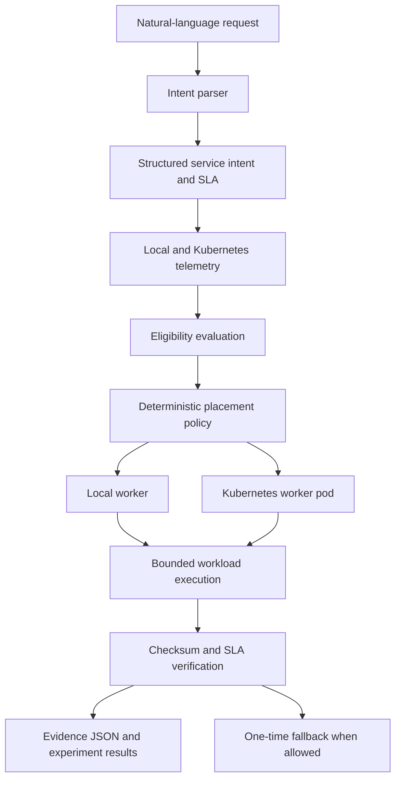

# AION-6G

**AI-Native Intent Orchestrator for Cloud–Edge Systems**

AION-6G is an experimental, AI-native and 6G-oriented intent orchestration
testbed for Cloud–Edge systems.

It accepts natural-language service requirements, converts them into structured
SLA constraints, evaluates local and Kubernetes execution targets, selects a
target through deterministic placement logic, runs a bounded workload, verifies
the result, and stores machine-readable evidence.

> AION-6G is not a real 6G radio deployment, network-slicing platform,
> Open RAN implementation, operator network, or production telecom system.
> The term “6G-oriented” refers to the intent-driven, SLA-aware Cloud–Edge
> research context.

## Current validation status

**Engineering classification:** `READY FOR PRIVATE REVIEW`

| Capability                         | Status      |
| ---------------------------------- | ----------- |
| Local FastAPI runtime              | VERIFIED    |
| Local bounded workload execution   | VERIFIED    |
| Docker runtime                     | VERIFIED    |
| Docker restart recovery            | VERIFIED    |
| Isolated kind cluster              | VERIFIED    |
| Real Kubernetes worker pod         | VERIFIED    |
| Real Kubernetes workload execution | VERIFIED    |
| Always-local placement             | VERIFIED    |
| Always-kubernetes placement        | VERIFIED    |
| Adaptive placement                 | VERIFIED    |
| Adaptive local selection           | VERIFIED    |
| Adaptive Kubernetes selection      | VERIFIED    |
| Local-to-Kubernetes fallback       | VERIFIED    |
| Three service profiles             | VERIFIED    |
| Six validation scenarios           | FUNCTIONAL  |
| Security scan                      | VERIFIED    |
| Kubernetes CPU/RAM telemetry       | UNAVAILABLE |
| Jitter, packet loss and bandwidth  | EMULATED    |

## What the project does

The orchestration flow is:

1. Receive a natural-language service request.
2. Parse it into a structured service intent and SLA.
3. Collect telemetry from the available targets.
4. Reject targets that do not satisfy eligibility requirements.
5. Score the remaining candidates.
6. Select a local or Kubernetes target.
7. Execute an allowlisted bounded workload.
8. Verify the checksum, runtime identity, metadata and SLA result.
9. Retry once on another runtime when fallback is allowed.
10. Store the final result as structured evidence.

Placement is deterministic. An optional LLM-assisted parsing path may help
interpret an intent, but it does not directly override the placement decision.

## Architecture

