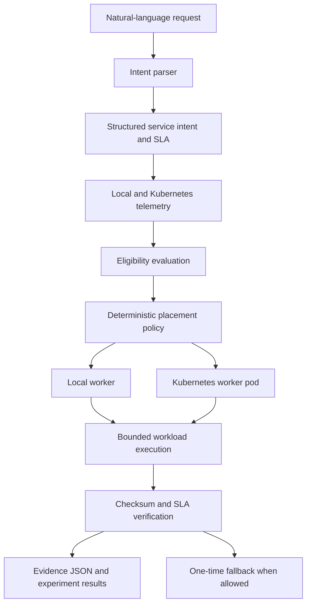

# AION-6G

**AI-Native Intent Orchestrator for Cloud–Edge Systems**

AION-6G is an experimental, AI-native and 6G-oriented intent orchestration testbed for Cloud–Edge systems.

The system accepts natural-language service requirements, converts them into structured SLA constraints, evaluates local and Kubernetes execution targets, selects a target through deterministic placement logic, executes a bounded workload, verifies the result, and stores machine-readable evidence.

> AION-6G is not a real 6G radio deployment, network-slicing platform, Open RAN implementation, operator network, or production telecom system.
> The term **6G-oriented** refers to the intent-driven, SLA-aware Cloud–Edge research context.

## Current validation status

**Engineering classification:** `READY FOR PRIVATE REVIEW`

The project has been validated across local, Docker, and Kubernetes execution paths.

| Capability                         | Status      |
| ---------------------------------- | ----------- |
| Local FastAPI runtime              | VERIFIED    |
| Local bounded workload execution   | VERIFIED    |
| Docker runtime                     | VERIFIED    |
| Docker restart recovery            | VERIFIED    |
| Isolated kind cluster              | VERIFIED    |
| Real Kubernetes worker pod         | VERIFIED    |
| Real Kubernetes workload execution | VERIFIED    |
| Always-local placement             | VERIFIED    |
| Always-kubernetes placement        | VERIFIED    |
| Adaptive placement                 | VERIFIED    |
| Adaptive local selection           | VERIFIED    |
| Adaptive Kubernetes selection      | VERIFIED    |
| Local-to-Kubernetes fallback       | VERIFIED    |
| Three service profiles             | VERIFIED    |
| Six validation scenarios           | FUNCTIONAL  |
| Security scan                      | VERIFIED    |
| Kubernetes CPU/RAM telemetry       | UNAVAILABLE |
| Jitter, packet loss and bandwidth  | EMULATED    |

The project is suitable for technical and research review, but it is not production-ready.

## What the project does

The main orchestration flow is:

1. Receive a natural-language service request.
2. Parse it into a structured service intent and SLA.
3. Collect telemetry from the available execution targets.
4. Reject targets that do not satisfy eligibility requirements.
5. Score the remaining candidates.
6. Select a local or Kubernetes target.
7. Execute an allowlisted and bounded workload.
8. Verify the checksum, runtime identity, metadata and SLA result.
9. Retry once on another runtime when fallback is permitted.
10. Store the final result as structured evidence.

Placement is deterministic. An optional LLM-assisted parsing path may help interpret an intent, but it does not directly override the placement decision.

## Architecture



## Main components

| Layer                | Responsibility                                                 |
| -------------------- | -------------------------------------------------------------- |
| FastAPI API          | Health, readiness, profiles, telemetry and orchestration       |
| Intent parser        | Converts service requests into structured intents              |
| Pydantic models      | Validates intents, telemetry and results                       |
| Telemetry collectors | Observe local and Kubernetes runtime state                     |
| Eligibility engine   | Rejects candidates that violate SLA requirements               |
| Placement engine     | Performs deterministic scoring and target selection            |
| Worker API           | Executes bounded workloads                                     |
| Verification layer   | Checks checksum, runtime identity, metadata and SLA conditions |
| Evidence layer       | Stores JSON results, experiment summaries and statistics       |

## Execution environments

### Local runtime

The local target uses a host-based HTTP worker.

Local CPU and RAM are measured with `psutil`, while endpoint latency is measured through a real HTTP request.

A successful local execution must return:

- `LOCAL` runtime identity
- successful workload status
- deterministic checksum
- valid SLA verification

### Docker runtime

Docker Compose runs two isolated AION-6G services:

- the orchestration API
- a dedicated containerized worker

The Docker worker returns `DOCKER` as its runtime identity.

Docker validation includes:

- image build
- service startup
- health and readiness checks
- bounded workload execution
- controlled worker restart
- worker recovery
- checksum consistency before and after restart

### Kubernetes runtime

The Kubernetes worker runs in an isolated local kind cluster.

Validated configuration:

| Resource        | Value                     |
| --------------- | ------------------------- |
| Cluster         | `aion-6g-cluster`       |
| Context         | `kind-aion-6g-cluster`  |
| Namespace       | `aion-6g`               |
| Deployment      | `aion6g-worker`         |
| Service         | `aion6g-worker`         |
| Service type    | `ClusterIP`             |
| Worker endpoint | `http://127.0.0.1:8002` |

The worker is accessed through localhost port forwarding.

A Kubernetes result cannot be marked as successful unless the orchestrator receives a real response from the worker pod and verifies:

- cluster
- namespace
- deployment
- pod name
- pod UID
- container
- ready replicas
- restart count
- worker endpoint
- `KUBERNETES` runtime identity
- workload checksum

This prevents local or simulated execution from being presented as real Kubernetes execution.

## Truthful execution modes

AION-6G uses five explicit execution modes.

| Mode            | Meaning                                      |
| --------------- | -------------------------------------------- |
| `LOCAL`       | Real host-local worker execution             |
| `DOCKER`      | Real Docker worker execution                 |
| `KUBERNETES`  | Real Kubernetes pod execution                |
| `SIMULATED`   | Historical or explicitly simulated execution |
| `UNAVAILABLE` | The requested runtime could not execute      |

A simulated execution cannot be reported as a real Kubernetes result.

When a runtime is unavailable, missing execution latency is stored as `null`. The system does not replace missing measurements with an artificial `0 ms`.

## Intent and SLA model

A service intent can contain requirements such as:

- service type
- maximum latency
- maximum jitter
- maximum packet loss
- minimum bandwidth
- maximum CPU utilization
- maximum memory utilization
- priority
- fallback permission

Example request:

```text
Deploy a critical-control workload with latency below 20 ms and CPU below 70%.
```

The parser converts this request into a validated structured intent before placement begins.

## Service profiles

AION-6G includes three experimental service profiles.

### `critical-control`

A reliability-sensitive control workload with strict latency, jitter, packet-loss and CPU requirements.

### `immersive-xr`

A latency-sensitive interactive workload with additional bandwidth requirements.

### `massive-iot`

A batch-style workload designed around scalability and packet-loss constraints.

These profiles are inspired by possible 6G service categories. They are not official standardized network slices.

## Placement policies

### `always-local`

Forces placement on the local target when it is available and eligible.

### `always-kubernetes`

Forces execution through the real Kubernetes worker pod.

### `adaptive`

Evaluates both targets and selects the highest-scoring eligible candidate.

The adaptive policy considers:

- target health
- target readiness
- measured HTTP latency
- CPU and RAM when available
- requested SLA constraints
- service priority
- target eligibility

Missing Kubernetes CPU or RAM telemetry is handled conservatively. Missing metrics are not treated as perfect values.

## Adaptive placement demonstrations

### Baseline selection

With both targets healthy and eligible, the adaptive policy selected the local worker and completed the workload successfully.

Example candidate scores:

| Candidate           | Eligible | Score |
| ------------------- | -------: | ----: |
| `local-edge`      |      Yes |  0.96 |
| `kubernetes-edge` |      Yes |  0.83 |

### Controlled local high CPU

The local CPU value was set to `99%` using a clearly labelled controlled scenario override.

As a result:

1. The local target became ineligible.
2. Kubernetes remained healthy.
3. The real Kubernetes pod was selected.
4. The workload completed successfully.
5. Verification returned `PASSED`.

The high CPU value is classified as `CONTROLLED`. It is not presented as a measured `psutil` observation.

## Cross-runtime fallback

A successful fallback follows this sequence:

1. Adaptive placement initially selects the local worker.
2. A controlled local execution failure is injected.
3. The original failure and reason are preserved.
4. The orchestrator performs exactly one retry.
5. Kubernetes is selected.
6. A real worker pod returns `KUBERNETES` identity and pod metadata.
7. Checksum and SLA verification pass.

The failure path was also tested by scaling the Kubernetes deployment to zero.

In that case, the final result remained:

```text
UNAVAILABLE / FAILED
```

The system does not fabricate recovery when the fallback runtime is unavailable.

## Validation scenarios

The project contains six validation scenarios.

| Scenario                    | Purpose                                       | Data source         |
| --------------------------- | --------------------------------------------- | ------------------- |
| `baseline`                | Normal local and Kubernetes evaluation        | MEASURED / EMULATED |
| `local-high-cpu`          | Reject the local target and select Kubernetes | CONTROLLED          |
| `kubernetes-high-latency` | Add Kubernetes latency degradation            | EMULATED            |
| `packet-loss-degradation` | Evaluate packet-loss SLA behavior             | EMULATED            |
| `selected-target-failure` | Test one-time cross-runtime fallback          | CONTROLLED          |
| `no-eligible-target`      | Verify truthful failure with no valid target  | CONTROLLED          |

The `no-eligible-target` scenario is expected to return:

```text
UNAVAILABLE / FAILED
```

This is considered correct behavior, not a failed implementation.

## Verified results

| Result                       |     Value |
| ---------------------------- | --------: |
| Standard tests               | 36 passed |
| Docker integration tests     |  1 passed |
| Kubernetes integration tests |  1 passed |
| Docker containers            | 2 healthy |
| Kubernetes ready replicas    |       1/1 |
| Kubernetes pod restarts      |         0 |
| Total experiment runs        |        60 |
| Successful experiment runs   |        56 |
| Failed experiment runs       |         4 |
| Always-local runs            |        20 |
| Always-kubernetes runs       |        20 |
| Adaptive runs                |        20 |
| Gitleaks findings            |         0 |

The four failed experiment rows were intentionally preserved. They represent cases where execution completed but the requested SLA was not satisfied.

## Experiment dataset

The validation dataset contains:

- 20 `always-local` runs
- 20 `always-kubernetes` runs
- 20 `adaptive` runs
- 60 total runs
- 56 passed SLA verification
- 4 failed SLA verification

The experiment runner records:

- run identifier
- timestamp
- placement policy
- service profile
- scenario
- selected target
- execution mode
- execution result
- SLA status
- fallback usage
- orchestration time
- local HTTP latency
- Kubernetes HTTP latency
- local CPU and RAM
- network-condition provenance
- rejection reasons

Failed rows remain in the dataset and are included in the statistics.

## Telemetry and measurement sources

| Metric            | Local                   | Kubernetes  |
| ----------------- | ----------------------- | ----------- |
| CPU               | MEASURED with`psutil` | UNAVAILABLE |
| RAM               | MEASURED with`psutil` | UNAVAILABLE |
| HTTP latency      | MEASURED                | MEASURED    |
| Ready replicas    | Not applicable          | MEASURED    |
| Pod restart count | Not applicable          | MEASURED    |
| Jitter            | EMULATED                | EMULATED    |
| Packet loss       | EMULATED                | EMULATED    |
| Bandwidth         | EMULATED                | EMULATED    |

Kubernetes CPU and RAM were unavailable because the Kubernetes Metrics API was not installed in the validation cluster.

### Latency terminology

The project distinguishes between three different measurements.

#### Worker computation latency

Time spent performing the bounded workload inside the selected worker.

#### HTTP round-trip latency

Time required to reach the worker endpoint and receive a response.

#### Total orchestration time

Time spent on intent parsing, telemetry collection, Kubernetes queries, eligibility evaluation, placement, execution and verification.

The observed Kubernetes worker computation value of approximately `0.05 ms` must not be interpreted as Kubernetes network latency.

Kubernetes HTTP measurements pass through localhost port forwarding into the ClusterIP service and pod. They are not radio, WAN or 6G latency measurements.

## Requirements

Recommended local environment:

- Python 3.11
- Docker Desktop
- Docker Compose
- kubectl
- kind
- Windows PowerShell

## Local setup

Create and activate a Python environment:

```powershell
py -3.11 -m venv .venv
.\.venv\Scripts\Activate.ps1

python -m pip install --upgrade pip
python -m pip install -r requirements.txt
```

Start the API:

```powershell
python -m uvicorn app.main:app --host 127.0.0.1 --port 8000
```

Open the dashboard:

```text
http://127.0.0.1:8000/
```

Open the FastAPI documentation:

```text
http://127.0.0.1:8000/docs
```

Check health and readiness:

```powershell
curl.exe http://127.0.0.1:8000/health
curl.exe http://127.0.0.1:8000/ready
```

## Docker setup

Validate the Compose configuration:

```powershell
docker compose -p aion6g config
```

Build and start the services:

```powershell
docker compose -p aion6g build
docker compose -p aion6g up -d --remove-orphans
docker compose -p aion6g ps
```

Restart the Docker worker:

```powershell
docker compose -p aion6g restart aion6g-local-worker
```

View recent logs:

```powershell
docker compose -p aion6g logs --no-color --tail 100
```

## Kubernetes kind setup

Create the isolated cluster:

```powershell
kind create cluster `
  --name aion-6g-cluster `
  --image kindest/node:v1.36.1 `
  --wait 180s
```

Load the worker image:

```powershell
kind load docker-image aion6g-worker:validation `
  --name aion-6g-cluster
```

Apply the Kubernetes resources:

```powershell
kubectl --context kind-aion-6g-cluster apply `
  -f deployments/kubernetes/
```

Check deployment, pods and services:

```powershell
kubectl --context kind-aion-6g-cluster `
  get deployments,pods,services `
  -n aion-6g
```

Wait for the deployment:

```powershell
kubectl --context kind-aion-6g-cluster `
  rollout status deployment/aion6g-worker `
  -n aion-6g `
  --timeout=180s
```

Start port forwarding:

```powershell
kubectl --context kind-aion-6g-cluster `
  port-forward `
  -n aion-6g `
  service/aion6g-worker `
  8002:8001
```

## Validation commands

Run the full validation:

```powershell
python scripts/run_full_validation.py
```

Generate experiment evidence:

```powershell
python scripts/generate_experiment_evidence.py
```

Run the standard test suite:

```powershell
pytest -m "not docker and not kubernetes" -ra
```

Run the Docker integration test:

```powershell
$env:AION_RUN_DOCKER_TESTS="1"
pytest -m docker -ra
```

Run the Kubernetes integration test:

```powershell
$env:AION_RUN_KUBERNETES_TESTS="1"
pytest -m kubernetes -ra
```

Compile the Python source:

```powershell
python -m compileall app scripts tests
```

## Security

The repository was scanned using Gitleaks `8.30.1`.

Validated results:

- Git-history findings: `0`
- Working-tree findings: `0`

Security controls include:

- allowlisted workload types
- bounded numeric parameters
- Pydantic request validation
- HTTP timeouts
- kubectl timeouts
- no client-controlled shell command API
- internally generated result paths
- no public Kubernetes `LoadBalancer`
- no credentials inside Kubernetes manifests
- ignored local `.env` file
- empty `.env.example`

Security scan commands:

```powershell
gitleaks git . --redact=100 --report-format json
gitleaks dir . --redact=100 --report-format json
```

## Evidence and reports

Main validation artifacts:

- [Final validation report](docs/final-validation.md)
- [Final validation JSON](results/final_validation.json)
- [Docker validation](results/docker_validation.json)
- [Kubernetes validation](results/kubernetes_validation.json)
- [Kubernetes workload evidence](results/kubernetes_edge_success.json)
- [Successful cross-runtime fallback](results/fallback_real_success.json)
- [Failed cross-runtime fallback](results/fallback_real_failure.json)
- [Experiment summary CSV](results/experiment_summary.csv)
- [Experiment summary JSON](results/experiment_summary.json)
- [Experiment statistics](results/experiment_statistics.json)
- [Security scan](results/security_scan.json)
- [Full technical report PDF](docs/AION-6G_Technical_Report_Full_Validation.pdf)

Additional evidence includes policy, profile and scenario-specific JSON files under the `results/` directory.

## Repository structure

```text
AION-6G/
├── app/
│   ├── experiments/
│   ├── execution/
│   ├── models/
│   ├── orchestration/
│   ├── placement/
│   ├── telemetry/
│   └── verification/
├── deployments/
│   └── kubernetes/
├── docs/
├── profiles/
├── results/
├── scripts/
├── tests/
├── docker-compose.yml
├── Dockerfile
└── README.md
```

## Known limitations

- Local, Docker and kind runtimes currently share one Windows and Docker Desktop host.
- The kind cluster is local and does not represent a remote cloud provider.
- Kubernetes CPU and RAM metrics are unavailable without metrics-server.
- Kubernetes HTTP latency is measured through localhost port forwarding.
- Jitter, packet loss and bandwidth are emulated.
- Controlled failures and controlled high-CPU values are not real production incidents.
- The workloads are short bounded correctness demonstrations.
- The 60-run dataset is a functional validation dataset, not a large statistical benchmark.
- Authentication and authorization are not production-grade.
- The system has not been deployed on independent physical edge hardware.
- The project is not production-ready telecom infrastructure.

## Threats to validity

- Local, Docker and Kubernetes runtimes share the same physical machine.
- Localhost and port-forward latency cannot be generalized to WAN or radio networks.
- Short workloads validate execution correctness rather than sustained throughput.
- The experiment dataset is relatively small.
- Network conditions are scenario-driven rather than packet-level measurements.
- Results may vary across operating systems, hardware and Docker Desktop configurations.

## Future work

Planned improvements include:

- metrics-server or another verified Kubernetes telemetry source
- remote and multi-node Cloud–Edge targets
- larger repeated experiments
- packet-level network emulation with `tc`, `netem` or equivalent tools
- optional LLM-assisted intent interpretation
- stronger authentication and authorization
- signed or tamper-evident evidence
- multi-cluster orchestration
- deployment on independent physical edge hardware
- workload throughput and stress testing
- possible integration with an Open RAN or 5G/6G research testbed

## Project scope

AION-6G should be described as:

> An experimental, AI-native and 6G-oriented intent orchestration testbed for Cloud–Edge systems.

It should not be described as:

- a real 6G deployment
- a real mobile network
- a network-slicing implementation
- an Open RAN platform
- an operator-grade system
- a production orchestration platform
- a source of real radio latency measurements

## Author

**Dionisios Mylonas**

## License

No open-source license has been selected yet.

Until a license is added, the source code remains protected by default copyright rules and may not be reused, redistributed or modified without permission.
