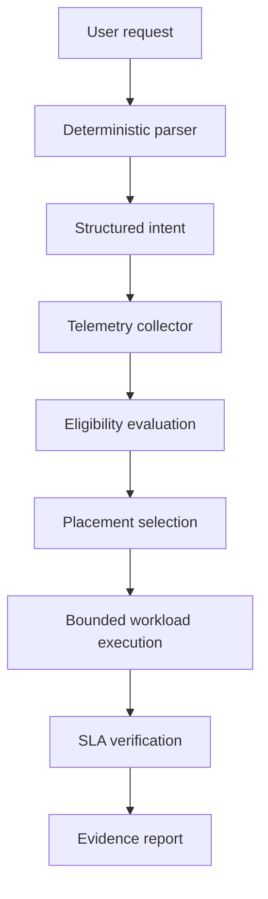

# Architecture

```mermaid
flowchart TD
    A[User request] --> B[Deterministic parser]
    B --> C[Structured intent]
    C --> D[Telemetry collector]
    D --> E[Eligibility evaluation]
    E --> F[Placement selection]
    F --> G[Bounded workload execution]
    G --> H[SLA verification]
    H --> I[Evidence report]
```

The system uses deterministic placement logic and real telemetry where available, while network conditions are explicitly separated into measured and emulated categories.
